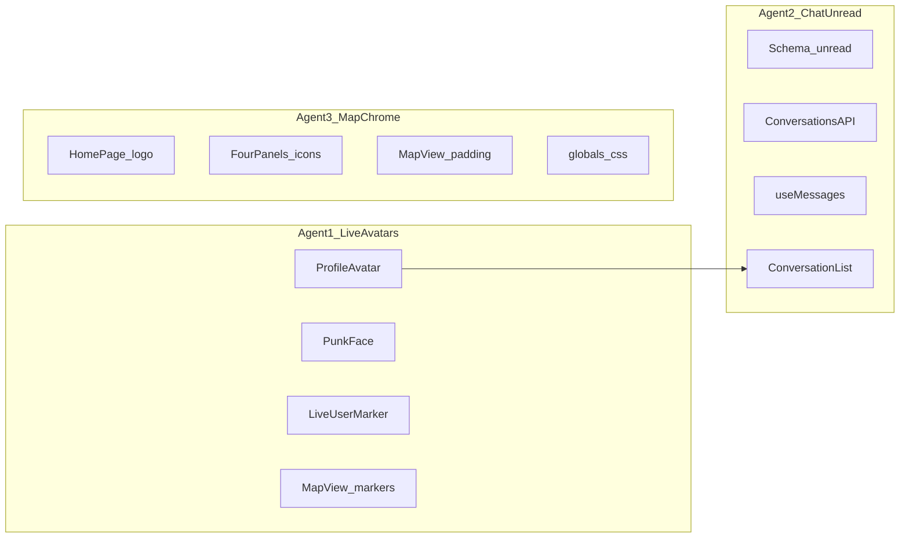

# Sniff UX Parallel Agents Plan

## Deliverable

Write this plan to `SniffUXparalelagentsplan.md` at the repo root, then launch the three agents in parallel with the ownership rules below.

## Locked decisions

| Track | Decision |
|-------|----------|
| 1 Glow | **Orange** halo = user is live on site (websocket + transmitting location = existing `isLit` / presence). Not a decorative always-on ring. |
| 1 Photo | Use existing single `users.photoUrl` as the avatar. Self marker shows **photo + orange glow** when lit and photo exists. |
| 1 Fallback | No photo → circular **punk face** (not initials/dot). Multiple SVG variants inspired by `punkfaces.jpg`; **stable** assignment via hash of `userId` (not flicker-random each render). Applies anywhere `ProfileAvatar` is used. |
| 2 Chat | Compact row density/aesthetic **and** real unread badges (not `conversations.length`). |
| 3 Map | MapLibre padding so interaction stays inside the four corner controls; center **into.now** logo top-middle; redesign four corner icons for Filters / Profile / Messages / Posts. |

Reference images (workspace assets): realtime glow map, condensed chat list, confine-map controls, punk face sheet.

## How to run in parallel (multi-agent)

Launch **three local agents** in one turn (Cursor Task / parallel agents), each with a strict file-ownership prompt. Do not let two agents edit the same file.

**Merge order after agents finish:** Agent 1 → Agent 2 → Agent 3 (or rebase each onto main sequentially). Smoke-test: lit photo glow, no-photo punk face stable, unread badge, map padding + logo + corner icons.

**Shared seams (hand off, don’t dual-edit):**
- `MessagePanel.tsx`: Agent 3 owns collapsed FAB icon; Agent 2 only changes `unreadCount` meaning + list area via `ConversationList`.
- `MapView.tsx`: Agent 1 owns marker JSX / self photo props; Agent 3 owns `setPadding` / layout only — coordinate via a short comment block or Agent 3 lands padding first if conflict.

---

## Agent 1 — Orange realtime glow + punk avatars

**Owns:** `ProfileAvatar.tsx`, new `PunkFace.tsx` (or `punkFaces.tsx`), `LiveUserMarker.tsx`, marker wiring in `MapView.tsx` (self photo).

### Glow
- Replace green `animate-ping` / green box-shadow on lit markers with a soft **orange** outer glow (e.g. brand-adjacent `#FF7A1A` / `#FF6B35`): blurred ring or layered `box-shadow`, optional slow pulse — not a hard radar ping.
- Glow only when `isLit === true` (presence already driven by Pusher/websocket + location in `useLivePresence.ts`). Unlit: no orange glow; keep subdued treatment.
- Apply to both photo avatars and punk-face avatars when lit.

### Photo + self
- Pass current user’s `photoUrl` / `displayName` into self `LiveUserMarker` from `MapView` (from auth user already available on `HomePage`).
- When self has photo + lit → photo circle + orange glow (optional small “You” pill if space allows; not required for v1).
- When self has no photo → punk face + orange glow when lit.

### Punk faces
- Create **8 SVG variants** inspired by `punkfaces.jpg` sheet: yellow circular base, XX / wild eyes, squiggle or smirk mouths; include a few punchier variants (e.g. zipper mouth, asymmetric eyes) without needing mohawk geometry that won’t read at 32px.
- `ProfileAvatar` API: accept optional `userId` (for hash). If no `photoUrl`, render `PunkFace variant={hash(userId) % N}` instead of initials.
- Update call sites that have an id to pass `userId` (map users, conversation other user, profile). Fallback hash from `displayName` if id missing.
- Remove reliance on green dot-only self path when we always have either photo or punk face.

**Out of scope for Agent 1:** video/verified badges, presence API changes, push (`presencePush.ts`).

---

## Agent 2 — Compact chat list + real unread

**Owns:** `schema.ts` + migration, conversations GET + mark-read path, `useMessages.ts`, `ConversationList.tsx`, unread wiring into `MessagePanel.tsx` / `HomePage.tsx` props only.

### Unread model
Today there is **no** read state (`conversation_participants` is only `conversationId` + `userId`).

- Add `lastReadAt` (nullable timestamptz) on `conversation_participants`.
- Inbox API: for each convo, `unreadCount` = messages where `senderId !== me` and `createdAt > coalesce(lastReadAt, epoch)`.
- When user opens a thread (existing fetch in `useMessages`), PATCH/POST mark-read: set `lastReadAt = now()` for that participant.
- `ConversationSummary.unreadCount: number`; MessagePanel FAB badge = sum of unread across inbox (not conversation count). Fix `HomePage.tsx` `unreadCount={conversations.length}`.

### Compact UI
In `ConversationList` (and light padding trim in MessagePanel inbox body if needed):
- Single-row denser layout: smaller avatar, 1-line preview (`line-clamp-1`), tighter `py` / gaps, flatter chrome (less card padding).
- Right side: relative time + orange unread pill when `unreadCount > 0`.
- Do **not** add Sniffies Recents/Pinned/Screened tabs in this pass.
- Reuse `ProfileAvatar` (picks up punk faces from Agent 1 after merge).

---

## Agent 3 — Confine map + corner icons + centered logo

**Owns:** `HomePage.tsx` brand header, collapsed FABs in `FilterPanel.tsx` / `ProfilePanel.tsx` / `MessagePanel.tsx` / `PostPanel.tsx`, map padding in `MapView.tsx`, `globals.css` control offsets.

### Confine map
- Define shared chrome inset constants (corner control size + safe-area margins), e.g. ~56–72px per edge.
- In `MapView`, on load + resize: `map.setPadding({ top, bottom, left, right })` so pan/zoom/center stay inside the rectangle bounded by the four corners.
- Keep panels `fixed` at corners; map remains under them but camera math respects padding.
- Update MapLibre nav control offset CSS so zoom sits inside the padded region, not under BR FAB.

### Logo
- Add fixed top-center `into.now` wordmark (`/logo.svg`) on `HomePage` (safe-area aware, `z-20`).
- Remove logo from PostPanel collapsed FAB (and avoid duplicating brand in expanded header if redundant).
- Ensure no collision with InstallPrompt / location-denied banners (stack or offset).

### Four corner icons (same functions, clearer affordance)

| Corner | Panel | Icon meaning |
|--------|-------|----------------|
| TL | Filters | Filter / sliders |
| TR | Profile | Person / avatar (may keep small photo) |
| BL | Messages | Chat bubble (+ unread from Agent 2) |
| BR | Posts | Posts / community (people or pin-list) — **not** the logo |

Symmetrical circular (or equal-size) icon buttons, shared sizing/classes for a pleasing frame. Icons must match real actions (no travel/ghost icons for features we don’t have).

---

## Verification

- Lit user with photo: orange glow; leave site / go unlit: glow stops.
- User/self without photo: stable punk face across refreshes; glow when lit.
- Chat: rows denser; unread increments on inbound message; clears when thread opened; FAB shows total unread.
- Map: center-on-me / flyTo leaves subject inside inset; logo centered top; four corners icon-only and balanced.

## Explicit non-goals

- Cloning Sniffies features (video borders, verified seals, chat tabs, bottom tab bar).
- Renaming brand to Sniffies.
- Changing presence websocket protocol — only the visual meaning of `isLit`.
