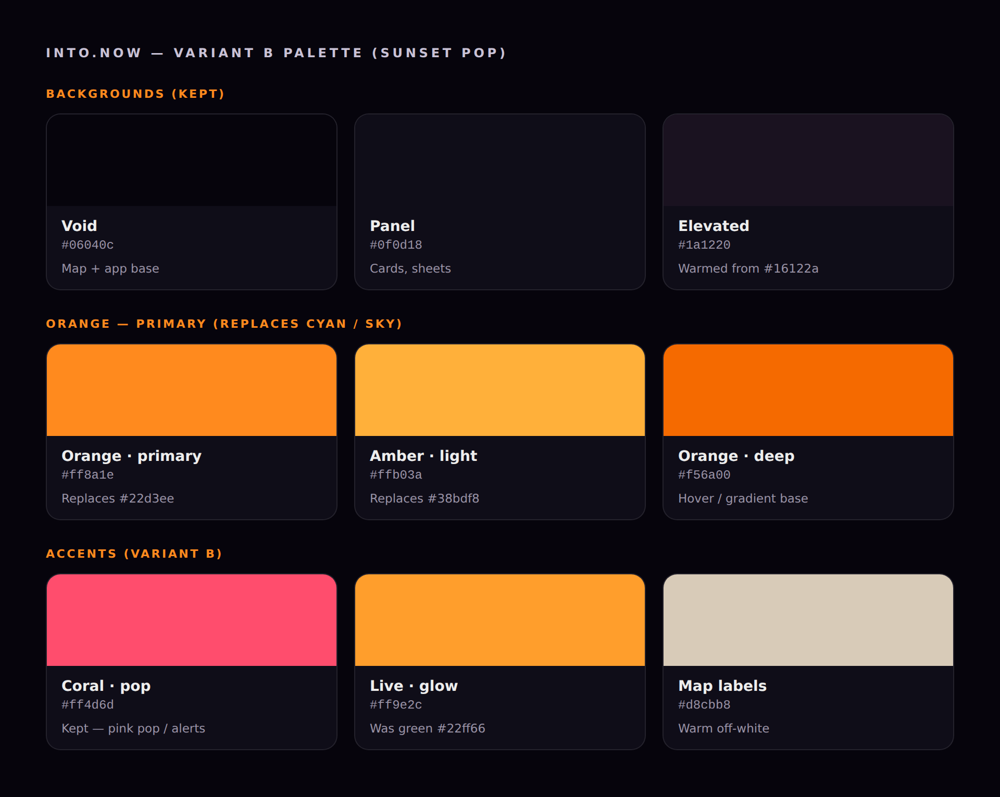
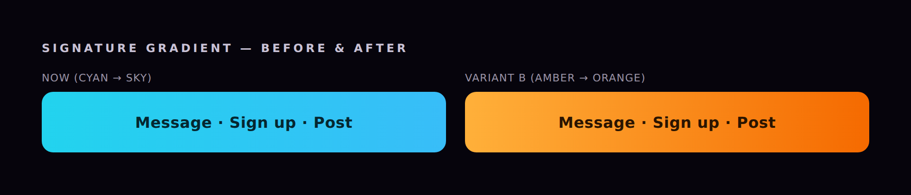
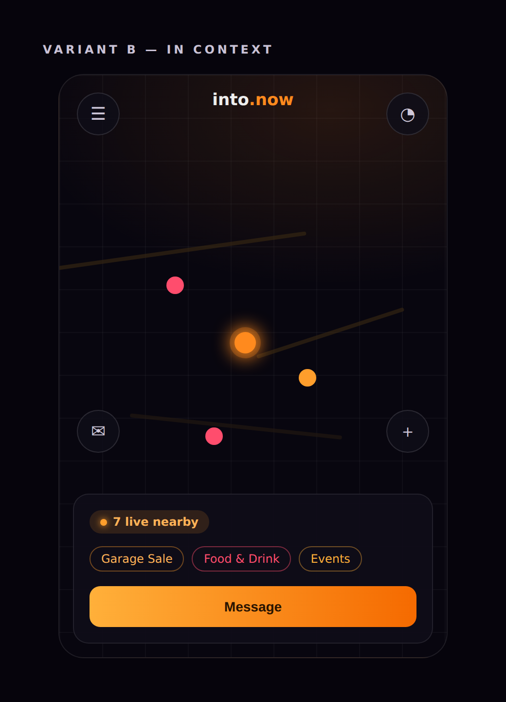

# into.now — UI Color Change: Blue → Orange (Variant B "Sunset Pop")

**Status:** Approved direction
**Owner:** sera
**Date:** 2026-07-29
**Scope:** Recolor the app from its current cyan/coral neon-on-dark scheme to an
orange-led scheme. Keep the dark map background. Convert the blue family (cyan
`#22d3ee` + sky `#38bdf8`) — which drives every primary button, badge, link, and
accent — into a warm amber→orange glow. Keep the coral as a pink "pop" accent.

---

## 1. The look







---

## 2. Palette (old → new)

### Backgrounds — KEEP (do not change)
| Token | Hex | Use |
|---|---|---|
| Void | `#06040c` | Map + app base |
| Surface | `#0a0814` | Deep surface |
| Panel | `#0f0d18` | Cards, bottom sheets, popups |
| Elevated | `#16122a` → **`#1a1220`** | Slightly warmed elevated surface (optional) |

### Primary — the blue family becomes orange
| Role | Old (blue) | New (orange) |
|---|---|---|
| Primary accent | `#22d3ee` (cyan) | **`#ff8a1e`** |
| Gradient light end | `#38bdf8` (sky) | **`#ffb03a`** (amber) |
| Gradient deep / hover | — | **`#f56a00`** |

### Accents (Variant B)
| Role | Old | New |
|---|---|---|
| Coral pop (hearts, alerts, "light is off") | `#ff4d6d` | **`#ff4d6d`** (KEEP) |
| Coral hover | `#ff6b8a` | `#ff6b8a` (keep) |
| "Live / online" glow | `#22ff66` (green) | **`#ff9e2c`** (amber) |

### Map (mapStyle.ts PALETTE) — warm the purples, keep it dark
| Key | Old | New | Note |
|---|---|---|---|
| `void` | `#06040c` | `#06040c` | same |
| `water` | `#0a3d52` | `#0a2f3a` | muted dark teal, still reads as water |
| `land` | `#0f0d18` | `#0f0d18` | same |
| `park` | `#0d1f14` | `#141a0d` | faint warm-green → keep subtle |
| `road` | `#2a2248` (purple) | `#241a10` | warm brown |
| `roadMajor` | `#3d3568` (purple) | `#3a2a12` | bronze/amber |
| `building` | `#16122a` | `#1c140f` | warm charcoal |
| `label` | `#c4bdd8` | `#d8cbb8` | warm off-white |

### Category marker colors (categories.ts) — leave as-is EXCEPT the fallback
These are semantic per-category identifiers; keep them. Only change the fallback,
which is currently coral, to the new primary orange:
```ts
// getCategoryColor fallback
return CATEGORY_COLORS[category as Category] ?? "#ff8a1e"; // was "#FF4D6D"
```

---

## 3. The core rule (this covers ~80% of the work)

The signature CTA/accent gradient appears throughout the components as:
```
bg-gradient-to-r from-[#22D3EE] to-[#38BDF8]
```
Replace **every** occurrence with:
```
bg-gradient-to-r from-[#FFB03A] to-[#F56A00]
```
(amber → deep orange, dark text stays legible on it).

Then, globally within `src/`, apply these literal swaps (case-insensitive, all
Tailwind arbitrary-value classes `[#...]`, inline `style`, and CSS):

| Find | Replace |
|---|---|
| `#22d3ee` / `#22D3EE` | `#ff8a1e` |
| `#38bdf8` / `#38BDF8` | `#ffb03a` |
| `#22ff66` / `#22FF66` | `#ff9e2c` |

Everything else (coral `#ff4d6d`, backgrounds, category colors) stays.

---

## 4. File-by-file

**`src/app/globals.css`** — update the CSS variables:
```css
:root{
  --intonow-coral:#ff4d6d;   /* keep */
  --intonow-cyan:#ff8a1e;    /* rename intent: now the orange primary */
  --intonow-void:#06040c;    /* keep */
}
```
> Optional but cleaner: rename `--intonow-cyan` → `--intonow-orange` and update
> the ~1 reference, or keep the variable name to minimize churn.

**`src/lib/mapStyle.ts`** — replace the `PALETTE` object per the Map table above.

**`src/lib/categories.ts`** — change only the `getCategoryColor` fallback (above).

**Components with the blue family** (apply §3 swaps):
`MapView.tsx`, `PostPanel.tsx`, `MessagePanel.tsx`, `ConversationThread.tsx`,
`ConversationList.tsx`, `FilterPanel.tsx`, `ProfilePanel.tsx`, `ProfileEditor.tsx`,
`AuthForm.tsx`, `PhoneAuthForm.tsx`, `OnboardingGate.tsx`, `InstallPrompt.tsx`,
`PushSettings.tsx`, `GrokAssist.tsx`, `app/admin/page.tsx`.

> Note: Tailwind arbitrary values are case-sensitive in the class string but the
> hex value itself is not; match both `#22D3EE` and `#22d3ee` forms.

---

## 5. Acceptance criteria
- No occurrences of `#22d3ee`, `#38bdf8`, or `#22ff66` remain in `src/`
  (`grep -ri` returns nothing).
- Every `from-[#22D3EE] to-[#38BDF8]` gradient now reads amber→orange.
- Map background stays dark; roads read warm bronze, water still reads as water.
- Coral `#ff4d6d` is untouched (pink pop remains).
- `npm run build` (or `tsc --noEmit` + `next lint`) passes with no new errors.

## 6. Verification commands
```bash
# should print nothing:
grep -rniE '#22d3ee|#38bdf8|#22ff66' src/
# typecheck:
npx tsc --noEmit
```
