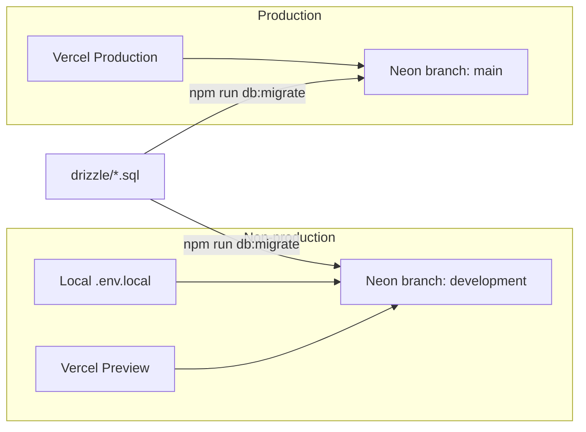

# Database: development-to-production consistency

This project uses **two Neon databases with one shared schema**. Same migrations, different data. That keeps local development safe and production stable.

## Environments

| Environment | Neon project / branch | Connection host (pooler) | Who uses it |
|-------------|------------------------|---------------------------|-------------|
| Local (`npm run dev`) | `into-now` → branch **`development`** | `ep-rapid-haze-a6qsmc5c-pooler.us-west-2.aws.neon.tech` | You on laptop |
| Vercel Preview | same **`development`** branch | same as local | Preview deployments |
| Vercel Production | `into-now` → branch **`main`** (production) | `ep-quiet-base-a6a3tlrl-pooler.us-west-2.aws.neon.tech` | Live users |

Neon project ID: `crimson-waterfall-78130428`  
- Production branch: `main` (`br-patient-cell-a6un52e0`)  
- Development branch: `development` (`br-muddy-butterfly-a6pizr1u`)

There is also a separate Neon project named `into-now-dev` (`bold-truth-66104878`). **Do not use it for this app anymore.** Local and Vercel Preview/Development should use the `development` branch of `into-now`.



## Why two databases

- Local experiments (anonymous users, test posts, schema trials) never corrupt live data.
- Production stays the source of truth for real users.
- Schema stays identical because both sides apply the **same** Drizzle migration files.

## Source of truth

| Piece | Location |
|-------|----------|
| Schema definition | [`src/lib/schema.ts`](src/lib/schema.ts) |
| Migration SQL | [`drizzle/`](drizzle/) (e.g. `0000_v2_identity.sql`, `0001_unread_tracking.sql`) |
| Migration journal | [`drizzle/meta/_journal.json`](drizzle/meta/_journal.json) |
| Drizzle config | [`drizzle.config.ts`](drizzle.config.ts) (reads `DATABASE_URL`) |
| Env checklist | [`.env.example`](.env.example) |

## Day-to-day workflow

### 1. Local setup

```bash
# Preferred: pull Development env (includes DATABASE_URL for the development branch)
vercel env pull .env.local --environment=development --yes

# Confirm you are NOT on production before coding:
grep '^DATABASE_URL=' .env.local
# Expect host: ep-rapid-haze-a6qsmc5c-pooler.us-west-2.aws.neon.tech
```

**Never** use `vercel env pull --environment=production` for daily local work. Production secrets are marked sensitive and often pull as empty strings, which also overwrites a working `.env.local`.

### 2. Schema change

```bash
# 1. Edit src/lib/schema.ts
# 2. Generate migration
npm run db:generate

# 3. Apply to development first (local .env.local already points at development)
npm run db:migrate

# 4. Test on localhost
npm run dev

# 5. Before or after shipping to production, migrate production explicitly:
DATABASE_URL='<production-pooled-url>' npm run db:migrate
```

Rules:

- Do **not** change columns only in the Neon console. Always add a Drizzle migration.
- Always migrate **development before production**.
- After migrate, spot-check both branches (e.g. that a new column exists).

### 3. Deploy

- Vercel **Production** uses production `DATABASE_URL` (`main` branch).
- Vercel **Preview** and **Development** use the `development` branch `DATABASE_URL`.
- Deploying code that expects a new column without running `db:migrate` on that environment causes 500s (this is how `last_read_at` broke conversations).

## Env variable rules

| Variable | Production | Preview | Development (Vercel + local) |
|----------|------------|---------|------------------------------|
| `DATABASE_URL` | `main` branch pooler | `development` branch pooler | `development` branch pooler |
| `DATABASE_URL_UNPOOLED` | `main` direct | `development` direct | `development` direct |
| Twilio / Pusher / Auth / etc. | Set on Production | Can share same values | Set on Development so `vercel env pull` works |

Only `DATABASE_URL` / `DATABASE_URL_UNPOOLED` **must** differ between prod and non-prod. Other secrets can be shared for this project size.

If `.env.local` gets wiped or overwritten:

1. Restore from a personal backup if you have one.
2. Or: `vercel env pull .env.local --environment=development --yes`
3. Confirm `DATABASE_URL` host is the **development** pooler above.
4. If Twilio/Pusher/etc. are empty, copy them from Vercel Production in the dashboard (sensitive values do not always appear in CLI pulls).

## Recovery checklist

After any `vercel env pull`:

```bash
grep '^DATABASE_URL=' .env.local | sed -E 's#.*@([^/?]+).*#\1#'
```

| Host contains | Meaning | Action |
|---------------|---------|--------|
| `ep-rapid-haze-…` | Development (correct for local) | OK |
| `ep-quiet-base-…` | Production | Stop. Point local back to development. |
| empty `DATABASE_URL=""` | Sensitive/empty pull | Re-pull Development or set URL manually |

## What was set up (2026-07-29)

1. Created Neon branch **`development`** from `main` on project `into-now`.
2. Vercel env:
   - Production → `main` `DATABASE_URL` / `DATABASE_URL_UNPOOLED`
   - Preview + Development → `development` branch URLs
3. Local `.env.local` → development `DATABASE_URL`.
4. Ran `npm run db:migrate` on **both** branches (includes `0001_unread_tracking` → `last_read_at` on `conversation_participants`).

## Quick reference commands

```bash
# Local migrate (uses .env.local DATABASE_URL)
npm run db:migrate

# Explicit production migrate
DATABASE_URL='postgresql://…@ep-quiet-base-a6a3tlrl-pooler.us-west-2.aws.neon.tech/neondb?sslmode=require' npm run db:migrate

# Explicit development migrate
DATABASE_URL='postgresql://…@ep-rapid-haze-a6qsmc5c-pooler.us-west-2.aws.neon.tech/neondb?sslmode=require' npm run db:migrate

# Refresh local env from Vercel Development
vercel env pull .env.local --environment=development --yes
```
