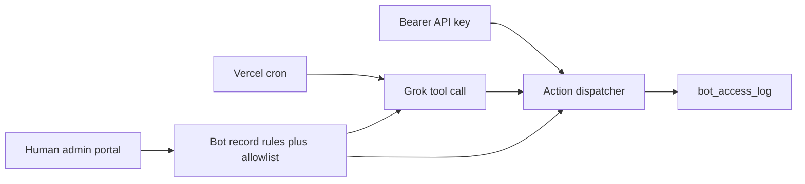

# Grok bots in the admin portal

Saved plan. Not built yet.

Bots do not get a human login. A human admin creates them under `/management`. Grok (`XAI_API_KEY`, already used by `src/app/api/assist/route.ts`) can only take actions the bot's allowlist permits. The rules text is the system prompt; it cannot widen permissions.

Two kinds:

- **Member** — a real `users` row (`authMethod: "bot"`, `isBot: true`) so posts, presence, and DMs use the existing user path. The map and thread show a Bot badge so people are not talking to an unlabeled account.
- **Staff** — support/admin actions only. Not an `admin_users` row, so a bot cannot pass TOTP, create admins, change moderation sensitivity, or manage other bots.

Modes, set per bot: **off**, **API only**, or **autonomous** (API key still works).

## Data

New tables in `src/lib/schema.ts` plus a Drizzle migration:

- `bots`: name, kind (`member` | `staff`), mode (`off` | `api` | `autonomous`), rules (text), permissions (json string array), `userId` (member only), `apiKeyHash`, `lastSeenAt`, `createdBy` admin id.
- `users.isBot` boolean, default false.
- `bot_access_log`: botId, action, ok, summary, metadata, createdAt.

API keys are random, stored only as a hash, shown once on create and on rotate.

## What each bot may do

Hard allowlist, checked in one dispatcher (`src/lib/bots/dispatch.ts`). Defaults are empty; the admin checks boxes.

Member: `read_nearby_posts`, `create_post`, `read_conversations`, `reply_message`, `start_conversation`. `start_conversation` stays off unless explicitly enabled.

Staff: `read_dashboard`, `read_activity`, `read_review_queue`, `decide_photo_review` (allow or uphold, reusing `src/lib/photoReview.ts`).

Denied for every bot: admin invites, moderation settings, bot create/edit, user deletion, photo upload.

## On-demand access

`POST /api/bot` with `Authorization: Bearer <key>` and `{ "action", "input" }`. Auth resolves the key, rejects `mode: off`, checks the allowlist, runs the action as that member user or as a staff actor, and writes `bot_access_log`. Also tag the existing `activity_log` row with `metadata.botId` when the action already logs (messages, posts, photo decisions).

## Autonomous runs

`GET /api/cron/bots` guarded like the other crons in `vercel.json` (`CRON_SECRET`). Schedule `*/15 * * * *`.

For each bot in `autonomous` mode: build a short context snapshot from its allowed reads, call Grok with tools limited to that allowlist and the bot's rules as the system prompt, execute at most 5 tool calls, then stop. Failures are logged and do not disable the bot. A **Run now** button on the bot page uses the same runner.

## Portal

New nav item in `src/components/management/ManagementShell.tsx`: **Bots**.

- List: name, kind, mode, last access.
- Create / edit: name, kind, rules textarea, permission checkboxes, mode.
- Reveal the API key once; rotate and disable.
- Per-bot access log (time, action, ok/fail, summary).
- Activity page (`src/app/management/activity/page.tsx`): a Bot filter, and a Bot label on rows whose metadata has `botId`.

Member badge: where `displayLabel` / map markers / thread headers render a user, show "Bot" when `users.isBot` is true.

## Build checklist

- Add `bots`, `bot_access_log`, and `users.isBot` with a Drizzle migration.
- Permission-checked action dispatcher for member and staff actions.
- Bearer `/api/bot` endpoint and autonomous cron runner using `XAI_API_KEY`.
- Management Bots page: rules, permissions, key, mode, access log.
- Bot badge on site surfaces and bot filter on the activity page.
